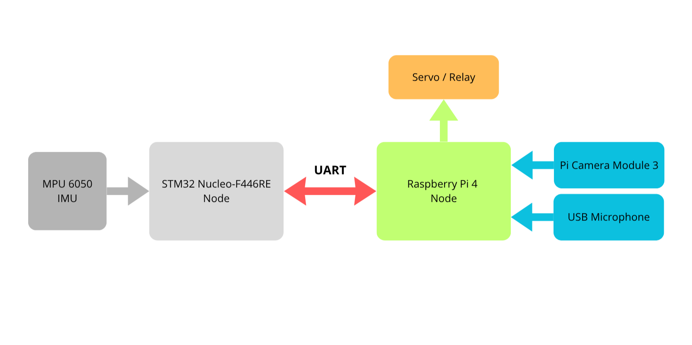

# ZERO — Edge AI Embedded System

A dual-node edge AI system built from scratch on real embedded hardware, designed as a complete learning project covering real-time firmware, on-device machine learning, and computer vision — developed following a professional V-model cycle with formal specifications, FSMs, and structured testing.

The STM32 node handles hard real-time sensing and runs a quantized AI model directly on-chip to detect anomalies in motion and vibration data. The Raspberry Pi node handles heavier inference using a camera and microphone. Both nodes communicate over UART, and physical actuators respond to AI decisions. The project is intentionally close to what a professional embedded AI system looks like — not a tutorial project.

---

## Architecture

---

## Nodes

- **STM32 Nucleo-F446RE** — C++17, FreeRTOS, TFLite Micro, real-time IMU anomaly detection on-chip
- **Raspberry Pi 4** — Python, computer vision (CNN), audio classification (spectrogram CNN)

---

## Stack

| Layer | Tools |
|---|---|
| STM32 firmware | C++17, FreeRTOS, TFLite Micro, STM32 HAL, STM32CubeMX, STM32CubeIDE, Renode |
| Pi inference | Python, TensorFlow Lite, OpenCV, librosa, PyAudio |
| Dev & CI | Docker, GitHub Actions, Doxygen, Git |

---

## Development Cycle

This project follows the **V-model**: specifications and FSMs are written
before implementation, every requirement is numbered and testable,
and each test level validates its corresponding design document.

Documentation lives in `docs/` — SRS, SAD, ICD, DDD, and TEST_SPEC.

---

## Status

🚧 Active development — Phase 0 (Specification & Design)  
Firmware prototype complete. Formalising architecture before continuing implementation.

| Phase | Description | Status |
|---|---|---|
| 0 | Specification & Design | 🚧 In progress |
| 1 | STM32 Firmware Foundations | 🔄 Prototype built — refactoring to spec |
| 2 | AI Pipeline on Pi | ⬜ |
| 3 | TinyML on STM32 | ⬜ |
| 4 | Integration & Acceptance Testing | ⬜ |

---

## Running the Project

> Build and run instructions will be added once Docker setup is complete.

---

## License

MIT
